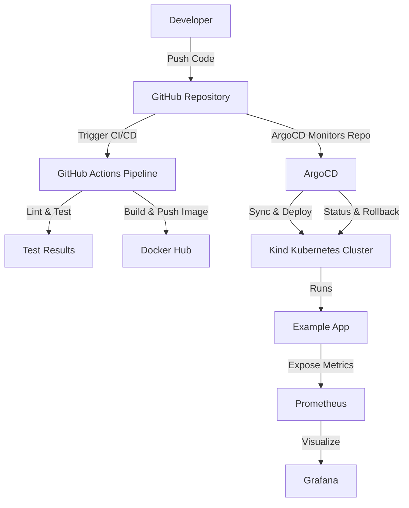

# Example App on Kubernetes with ArgoCD GitOps

This project demonstrates how to set up a complete GitOps workflow for a production-ready Python application. It uses Docker for containerization, Kind for a local Kubernetes cluster, Argo CD for GitOps-based deployment, and Prometheus and Grafana for monitoring.

## Table of Contents
1. [Overview](#overview)
2. [Features](#features)
3. [Architecture](#architecture)
4. [Prerequisites](#prerequisites)
5. [Quick Start](#quick-start)
6. [Project Structure](#project-structure)
7. [Application Endpoints](#application-endpoints)
8. [Setup and Deployment](#setup-and-deployment)
9. [Monitoring](#monitoring)
10. [CI/CD Pipeline](#cicd-pipeline)
11. [Development](#development)
12. [Repository](#repository)

## Overview
This project provides a hands-on example of deploying a web application to a Kubernetes cluster using GitOps principles. The core idea is to have a Git repository as the single source of truth for both application code and infrastructure configuration. Argo CD automatically syncs the desired state from the Git repo to the Kubernetes cluster.

## Features
- ✅ **Health Check & Metrics Endpoints** - Production-ready health probes and Prometheus metrics
- ✅ **Structured Logging** - Comprehensive logging throughout the application
- ✅ **Error Handling** - Graceful error handling with JSON responses
- ✅ **Environment Configuration** - Support for .env configuration files
- ✅ **Kind Kubernetes Cluster** - Local cluster with 1 control plane and 2 worker nodes
- ✅ **ArgoCD GitOps** - Automated deployment and sync from Git
- ✅ **GitHub Actions CI/CD** - Automated testing, linting, security scanning, and Docker builds
- ✅ **Comprehensive Tests** - Full test coverage with pytest
- ✅ **Monitoring Stack** - Prometheus and Grafana for observability
- ✅ **Multi-stage Docker Build** - Optimized production and debug images

## Architecture



*The diagram above illustrates the automated flow from code commit to deployment using GitOps and CI/CD.*

## Prerequisites
- Docker (20.10+)
- Kind (0.11+)
- kubectl (1.20+)
- Helm (3.0+)
- Git

## Quick Start

```bash
# Clone the repository
git clone https://github.com/Ashikuroff/example-app.git
cd example-app

# Create Kind cluster
kind create cluster --config kind-config.yaml

# Install dependencies
pip install -r src/requirements.txt

# Run tests
PYTHONPATH=. pytest test/ -v

# Run locally (development)
export FLASK_DEBUG=True
python src/server.py
```

Access the app at: `http://localhost:5000`

## Project Structure

```
.
├── .github/
│   └── workflows/
│       └── main.yml              # GitHub Actions CI/CD pipeline
├── argo/
│   ├── argo-cd/                 # Argo CD application manifests
│   └── example-app/             # Kubernetes manifests for the app
├── src/
│   ├── server.py                # Flask application
│   ├── requirements.txt          # Python dependencies
│   └── __init__.py              # Python package marker
├── test/
│   ├── test_server.py           # Test suite
│   └── __init__.py              # Python package marker
├── grafana/                      # Grafana setup documentation
├── promethues/                   # Prometheus setup documentation
├── .env.example                  # Environment configuration template
├── .gitignore                    # Git ignore rules
├── Dockerfile                    # Multi-stage Docker build
├── kind-config.yaml              # Kind cluster configuration
├── requirements-test.txt         # Testing dependencies
└── README.md                     # This file
```

## Application Endpoints

The Flask application exposes the following endpoints:

| Endpoint | Method | Description | Response |
|----------|--------|-------------|----------|
| `/` | GET | Main endpoint | `{"message": "Hello World!", "version": "1.0.0"}` |
| `/health` | GET | Health check | `{"status": "healthy", "service": "example-app"}` |
| `/metrics` | GET | Prometheus metrics | Prometheus format metrics |
| `/*` | ANY | 404 handler | `{"error": "Not found", "path": "..."}` |

## Setup and Deployment

### Step 1: Create Kind Cluster

This project uses [Kind](https://kind.sigs.k8s.io/) to create a local Kubernetes cluster with one control-plane node and two worker nodes.

```bash
kind create cluster --config kind-config.yaml
```

Check cluster status:
```bash
kubectl get nodes
```

### Step 2: Build and Push Docker Image

The `Dockerfile` uses multi-stage builds with two targets: `prod` (production) and `debug` (with ptvsd).

1. **Build the production image:**
   ```bash
   docker build -t <your-dockerhub-username>/example-app:1.0.0 --target prod .
   ```

2. **Push to Docker Hub:**
   ```bash
   docker push <your-dockerhub-username>/example-app:1.0.0
   ```

3. **Update deployment manifest:**
   Edit `argo/example-app/deployments/deployment.yaml` and update the image:
   ```yaml
   containers:
   - name: example-app
     image: <your-dockerhub-username>/example-app:1.0.0
   ```

   Commit and push the change:
   ```bash
   git add argo/example-app/deployments/deployment.yaml
   git commit -m "Update app image to version 1.0.0"
   git push
   ```

### Step 3: Install and Configure Argo CD

1. **Create Argo CD namespace:**
   ```bash
   kubectl create namespace argocd
   ```

2. **Install Argo CD:**
   ```bash
   kubectl apply -n argocd -f argo/argo-cd/install.yaml
   ```

3. **Access Argo CD UI:**
   ```bash
   kubectl port-forward svc/argocd-server -n argocd 8080:443
   ```
   Navigate to: `https://localhost:8080`

4. **Get initial password:**
   ```bash
   kubectl -n argocd get secret argocd-initial-admin-secret -o jsonpath="{.data.password}" | base64 -d
   ```
   Username: `admin` | Password: (from above command)

### Step 4: Deploy the Application

1. **Apply Argo CD application:**
   ```bash
   kubectl apply -f argo/argo-cd/app.yaml
   ```

2. **Monitor sync status:**
   Watch the Argo CD UI for the sync process. Once complete, the application will be running.

   The `syncPolicy` is set to `automated`, so future changes to manifests in `argo/example-app/` will automatically deploy.

### Step 5: Access the Application

1. **Port-forward the service:**
   ```bash
   kubectl port-forward svc/example-service -n example-app 8081:80
   ```

2. **Access in browser:**
   Navigate to: `http://localhost:8081`

## Monitoring

### Install Prometheus

[Prometheus](https://prometheus.io/) collects metrics from your application and cluster.

```bash
helm repo add prometheus-community https://prometheus-community.github.io/helm-charts
helm repo update
helm install prometheus prometheus-community/prometheus
kubectl port-forward svc/prometheus-server 9090:9090
```

Access Prometheus: `http://localhost:9090`

### Install Grafana

[Grafana](https://grafana.com/) visualizes metrics from Prometheus.

```bash
helm repo add grafana https://grafana.github.io/helm-charts
helm repo update
helm install grafana grafana/grafana
kubectl port-forward svc/grafana 3000:3000
```

Access Grafana: `http://localhost:3000`

**Default credentials:**
- Username: `admin`
- Password: (retrieve with `kubectl get secret --namespace default grafana -o jsonpath="{.data.admin-password}" | base64 --decode ; echo`)

## Development

This repository includes several convenience scripts and a Makefile to speed local development and validation:

- `scripts/setup.sh` — create a Python virtualenv at `.venv` and install dependencies from `src/requirements.txt` and `requirements-test.txt`.
- `scripts/test.sh` — run the test suite (`pytest`) with optional `--coverage` and `--lint` flags.
- `scripts/server.sh` — start the Flask application locally (`FLASK_PORT`, `FLASK_DEBUG` controlled via flags/env).
- `scripts/preflight.sh` — wrapper to run the Azure Deployment Preflight diagnostic (`.github/skills/azure-deployment-preflight/preflight.py`). Pass `--execute` to run `bicep`/`az` commands (requires CLIs + auth).
- `Makefile` — shortcuts for common tasks: `make setup`, `make test`, `make server`, `make preflight`, etc.

Example usage:

```bash
# prepare environment
./scripts/setup.sh

# run tests
./scripts/test.sh

# start dev server
./scripts/server.sh --port 5000 --debug

# run preflight (dry-run)
./scripts/preflight.sh --output preflight-report.md
```

## Preflight Validation

We added an Azure Deployment Preflight skill to help validate Bicep deployments before applying changes to Azure. Key points:

- Script: `.github/skills/azure-deployment-preflight/preflight.py`
- README: `.github/skills/azure-deployment-preflight/README.md`
- What it does: detects `azure.yaml` (azd projects), finds `.bicep` files and parameter files, checks for `az`, `azd`, and `bicep` CLIs, runs `bicep build` (dry-run) and generates a Markdown `preflight-report.md` describing issues and suggested remediation. With `--execute` it will attempt `az ... what-if` commands (requires auth and correct parameters).

Replace placeholder values (resource group, location) in the generated what-if commands before executing in CI or production.

## CI/CD Updates

The GitHub Actions workflows were updated to use supported action versions and modern Docker actions. Highlights:

- `actions/checkout@v4`
- `actions/setup-python@v5`
- `actions/upload-artifact@v4`
- `docker/setup-buildx-action@v3` (stable)
- `docker/login-action@v3`
- `docker/build-push-action@v6`

If your org uses pinned action SHAs instead of tags, consider updating the workflows to pin to a specific SHA for each action.

---

For any additional tooling or CI integration (e.g., automatically running the preflight in a PR), I can add a workflow example — tell me where you'd like it integrated.

**Add Prometheus Data Source:**
1. Go to Configuration → Data Sources
2. Click "Add data source" → Select "Prometheus"
3. URL: `http://prometheus-server.default.svc.cluster.local`
4. Click "Save & Test"

**Import Kubernetes Dashboard:**
1. Go to Dashboards → Import
2. Enter dashboard ID: `6417`
3. Click "Load" → "Import"

## CI/CD Pipeline

This project uses **GitHub Actions** for automated CI/CD. The pipeline includes:

### Jobs

1. **Test** - Runs pytest with full test coverage
2. **Lint** - Code quality checks with flake8 and pylint
3. **Security** - Security scanning with bandit
4. **Build** - Docker image build with caching
5. **Publish** - Push to Docker Hub (main/staging branches only)

### Triggers

- Push to: `main`, `staging`, `test`, `develop` branches
- Pull requests to: `main`, `staging`, `develop` branches

### Configuration

Set these secrets in GitHub repository settings:
- `DOCKER_USERNAME` - Your Docker Hub username
- `DOCKER_PASSWORD` - Your Docker Hub token/password

### Docker Image Tagging

Images are tagged automatically:
- `latest` - From main branch
- `main-{sha}` - Commit hash from main
- `staging-{sha}` - Commit hash from staging

## Development

### Setup Development Environment

```bash
# Clone repository
git clone https://github.com/Ashikuroff/example-app.git
cd example-app

# Create virtual environment (optional)
python -m venv venv
source venv/bin/activate  # On Windows: venv\Scripts\activate

# Install dependencies
pip install -r src/requirements.txt
pip install -r requirements-test.txt
```

### Configuration

Create a `.env` file based on `.env.example`:

```bash
cp .env.example .env
```

Edit `.env` to customize:
```env
FLASK_ENV=development
FLASK_DEBUG=True
FLASK_PORT=5000
LOG_LEVEL=DEBUG
```

### Running Tests

```bash
# Run all tests
PYTHONPATH=. pytest test/ -v

# Run with coverage
PYTHONPATH=. pytest test/ --cov=src --cov-report=html
```

### Running Locally

```bash
# Development mode (with auto-reload and debugger)
export FLASK_DEBUG=True
python src/server.py

# Production mode
export FLASK_DEBUG=False
gunicorn -w 4 -b 0.0.0.0:5000 src.server:app
```

### Code Quality

```bash
# Run linting
flake8 src/
pylint src/server.py

# Run security checks
bandit -r src/
```

## CI/CD & GitOps Flow

1. **Developer pushes code** to GitHub
2. **GitHub Actions** runs:
   - Tests (pytest)
   - Linting (flake8, pylint)
   - Security scan (bandit)
   - Docker build & push (on main/staging)
3. **Argo CD** monitors the repository
4. **Argo CD syncs** deployment manifests to cluster
5. **Kubernetes** deploys the new image
6. **Application** is now running with the latest changes

Any changes committed to `argo/example-app/` directory are automatically synced to the cluster by Argo CD.

## Repository

All code and configuration details can be found at:
[https://github.com/Ashikuroff/example-app](https://github.com/Ashikuroff/example-app)

## License

This project is provided as an educational example.
