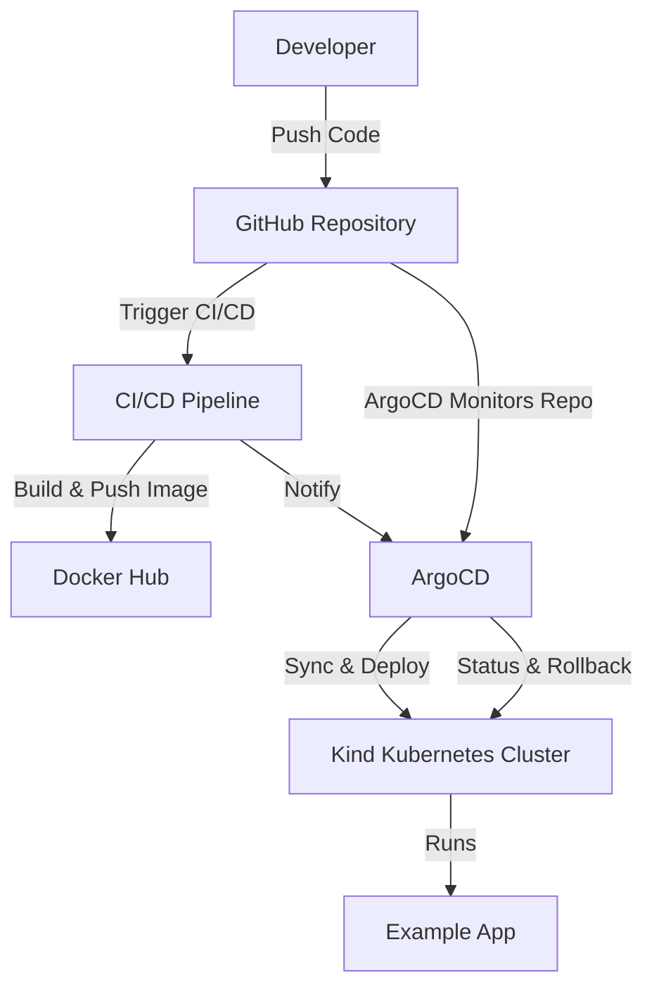

# Example App on Kubernetes with ArgoCD GitOps

## Table of Contents
1. [Overview](#overview)
2. [Architecture](#architecture)
3. [Features](#features)
4. [Prerequisites](#prerequisites)
5. [Setup & Deployment](#setup--deployment)
6. [CI/CD & GitOps Flow](#cicd--gitops-flow)
7. [Repository](#repository)

## Overview
This project demonstrates deploying a sample application to a local Kubernetes cluster using Kind, with GitOps managed by ArgoCD. The CI/CD pipeline builds Docker images and pushes them to Docker Hub, enabling automated deployments via ArgoCD.

## Architecture

*The diagram above illustrates the automated flow from code commit to deployment using GitOps and CI/CD.*

## Features
- Local Kind Kubernetes cluster (1 control plane, 2 worker nodes)
- ArgoCD for GitOps-based application deployment
- CI/CD pipeline for Docker image build and push
- Automated redeployment on code changes via ArgoCD sync

## Prerequisites
- Docker
- Kind
- kubectl
- ArgoCD

## Setup & Deployment
1. **Create Kind Cluster**
   - Set up a local Kubernetes cluster with Kind.
2. **Install ArgoCD**
   - Deploy ArgoCD to the cluster for GitOps management.
3. **CI/CD Pipeline**
   - Build Docker images and push to Docker Hub.
4. **Deploy Example App**
   - Use ArgoCD to deploy the sample app from the repository.

## CI/CD & GitOps Flow
- Any changes pushed to GitHub (application or deployment files) are automatically synced and redeployed by ArgoCD.

## Repository
All code and configuration details can be found at:
[https://github.com/Ashikuroff/example-app](https://github.com/Ashikuroff/example-app)
