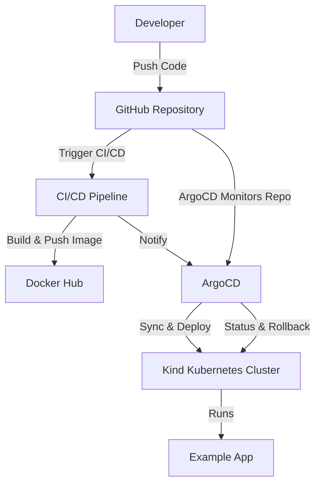

# Example App on Kubernetes with ArgoCD GitOps

This project demonstrates how to set up a complete GitOps workflow for a sample Python application. The workflow uses Docker for containerization, Kind for a local Kubernetes cluster, Argo CD for GitOps-based deployment, and Prometheus and Grafana for monitoring.

## Table of Contents
1. [Overview](#overview)
2. [Architecture](#architecture)
3. [Prerequisites](#prerequisites)
4. [Project Structure](#project-structure)
5. [Setup and Deployment](#setup-and-deployment)
    1. [Create Kind Cluster](#step-1-create-kind-cluster)
    2. [Build and Push Docker Image](#step-2-build-and-push-docker-image)
    3. [Install and Configure Argo CD](#step-3-install-and-configure-argo-cd)
    4. [Deploy the Application](#step-4-deploy-the-application)
    5. [Access the Application](#step-5-access-the-application)
6. [Monitoring](#monitoring)
    1. [Install Prometheus](#install-prometheus)
    2. [Install Grafana](#install-grafana)
7. [CI/CD & GitOps Flow](#cicd--gitops-flow)
8. [Repository](#repository)

## Overview
This project provides a hands-on example of deploying a web application to a Kubernetes cluster using GitOps principles. The core idea is to have a Git repository as the single source of truth for both application code and infrastructure configuration. Argo CD automatically syncs the desired state from the Git repo to the Kubernetes cluster.

## Architecture



*The diagram above illustrates the automated flow from code commit to deployment using GitOps and CI/CD.*

## Features
- Local Kind Kubernetes cluster (1 control plane, 2 worker nodes)
- ArgoCD for GitOps-based application deployment
- CI/CD pipeline for Docker image build and push
- Automated redeployment on code changes via ArgoCD sync
- Monitoring stack with Prometheus and Grafana

## Prerequisites
- Docker
- Kind
- kubectl
- ArgoCD

## Project Structure

The repository is structured as follows:

```
.
├── argo
│   ├── argo-cd           # Argo CD application manifests
│   └── example-app       # Kubernetes manifests for the application
├── grafana               # Documentation for Grafana setup
├── promethues            # Documentation for Prometheus setup
├── src                   # Python application source code
├── test                  # Application tests
├── .gitignore
├── Dockerfile            # Dockerfile for building the application image
├── kind-config.yaml      # Configuration for the Kind cluster
└── README.md
```

-   `argo/`: Contains all the GitOps-related manifests.
    -   `argo/argo-cd/app.yaml`: The Argo CD Application definition that points to the `example-app` directory.
    -   `argo/example-app/`: The Kubernetes manifests (Deployment, Service, etc.) for the application. This is the directory that Argo CD monitors.
-   `src/`: The Python Flask application source code.
-   `Dockerfile`: Used to build the container image for the application.
-   `kind-config.yaml`: The configuration file for creating the multi-node Kind cluster.

## Setup and Deployment
This section provides a step-by-step guide to deploy the application.

### Step 1: Create Kind Cluster

This project uses [Kind](https://kind.sigs.k8s.io/) to create a local Kubernetes cluster. The cluster is configured to have one control-plane node and two worker nodes, as defined in `kind-config.yaml`.

To create the cluster, run the following command:

```bash
kind create cluster --config kind-config.yaml
```

This command will use the `kind-config.yaml` file to set up your local Kubernetes cluster. To check the status of your nodes, you can run:

```bash
kubectl get nodes
```

### Step 2: Build and Push Docker Image

The `Dockerfile` in this project is a multi-stage build with two targets: `prod` for the production image and `debug` for a debugging image that includes `ptvsd`.

1.  **Build the Docker image:**

    To build the production image, run the following command from the root of the project. Replace `<your-dockerhub-username>` with your Docker Hub username and choose a tag (e.g., `1.0.0`).

    ```bash
    docker build -t <your-dockerhub-username>/example-app:1.0.0 --target prod .
    ```

2.  **Push the image to Docker Hub:**

    ```bash
    docker push <your-dockerhub-username>/example-app:1.0.0
    ```

3.  **Update the deployment manifest:**

    The Kubernetes deployment manifest at `argo/example-app/deployments/deployment.yaml` needs to be updated to use the image you just pushed. Open this file and change the `image` field to match the one you just created:

    ```yaml
    # argo/example-app/deployments/deployment.yaml
    ...
      containers:
      - name: example-app
        image: <your-dockerhub-username>/example-app:1.0.0 # <-- UPDATE THIS LINE
    ...
    ```

    After updating the file, commit and push the change to your Git repository.

### Step 3: Install and Configure Argo CD

Argo CD will be installed in your cluster to manage the application deployment.

1.  **Create the Argo CD namespace:**

    ```bash
    kubectl create namespace argocd
    ```

2.  **Apply the installation manifest:**

    This project includes the installation manifest for Argo CD.

    ```bash
    kubectl apply -n argocd -f argo/argo-cd/install.yaml
    ```

3.  **Access the Argo CD API Server:**

    To access the Argo CD UI, you can use port forwarding.

    ```bash
    kubectl port-forward svc/argocd-server -n argocd 8080:443
    ```

    You can now access the UI by navigating to `https://localhost:8080` in your browser.

4.  **Log in to Argo CD:**

    The initial password for the `admin` account is auto-generated and stored in a Kubernetes secret. You can retrieve it with the following command:

    ```bash
    kubectl -n argocd get secret argocd-initial-admin-secret -o jsonpath="{.data.password}" | base64 -d
    ```

    Use `admin` as the username and the retrieved password to log in to the Argo CD UI.

### Step 4: Deploy the Application

Now that Argo CD is set up, you can deploy the application. The `argo/argo-cd/app.yaml` file defines the Argo CD application, which points to your Git repository.

1.  **Apply the application manifest:**

    ```bash
    kubectl apply -f argo/argo-cd/app.yaml
    ```

    This command tells Argo CD to start monitoring the `argo/example-app` path in your repository for changes.

2.  **Sync the application:**

    Argo CD will automatically detect the application manifest and start syncing the resources. You can watch the sync process in the Argo CD UI. Once the sync is complete, the application will be running in your cluster.

    The `syncPolicy` in `app.yaml` is set to `automated`, so any future changes to the manifests in the `argo/example-app` directory will be automatically applied to the cluster.

### Step 5: Access the Application

Once the application is deployed and running, you can access it by port-forwarding the service.

1.  **Port-forward the service:**

    The `example-service` exposes the application on port 80. To access it from your local machine, run:

    ```bash
    kubectl port-forward svc/example-service -n example-app 8081:80
    ```

2.  **Access the application in your browser:**

    You can now open your browser and navigate to `http://localhost:8081` to see the "Hello World!" message from the application.

## Monitoring
This section explains how to set up Prometheus and Grafana for monitoring the application.

### Install Prometheus

[Prometheus](https://prometheus.io/) will be used to collect metrics from the cluster. It can be installed using Helm.

1.  **Add the Prometheus Helm repository:**

    ```bash
    helm repo add prometheus-community https://prometheus-community.github.io/helm-charts
    ```

2.  **Update your Helm repositories:**

    ```bash
    helm repo update
    ```

3.  **Install Prometheus:**

    ```bash
    helm install prometheus prometheus-community/prometheus
    ```

4.  **Expose the Prometheus server:**

    To access the Prometheus UI, you can expose the service using `port-forward`.

    ```bash
    kubectl port-forward svc/prometheus-server 9090:9090
    ```

    You can now access the Prometheus UI at `http://localhost:9090`.

### Install Grafana

[Grafana](https://grafana.com/) will be used to visualize the metrics collected by Prometheus.

1.  **Add the Grafana Helm repository:**

    ```bash
    helm repo add grafana https://grafana.github.io/helm-charts
    ```

2.  **Update your Helm repositories:**

    ```bash
    helm repo update
    ```

3.  **Install Grafana:**

    ```bash
    helm install grafana grafana/grafana
    ```

4.  **Get the Grafana admin password:**

    The initial admin password is created as a Kubernetes secret.

    ```bash
    kubectl get secret --namespace default grafana -o jsonpath="{.data.admin-password}" | base64 --decode ; echo
    ```

5.  **Access the Grafana UI:**

    ```bash
    kubectl port-forward svc/grafana 3000:3000
    ```

    You can now access the Grafana UI at `http://localhost:3000`. Log in with the username `admin` and the password you retrieved.

6.  **Add Prometheus as a Data Source:**

    - In the Grafana UI, navigate to "Configuration" > "Data Sources".
    - Click "Add data source" and select "Prometheus".
    - For the URL, enter `http://prometheus-server.default.svc.cluster.local`.
    - Click "Save & Test".

7.  **Import a Kubernetes Dashboard:**

    - In the Grafana UI, navigate to "Dashboards" > "Import".
    - In the "Import via grafana.com" field, enter the dashboard ID `6417`.
    - Click "Load" and then "Import" to add a pre-configured Kubernetes monitoring dashboard.

## CI/CD & GitOps Flow
- Any changes pushed to GitHub (application or deployment files) are automatically synced and redeployed by ArgoCD.

## Repository
All code and configuration details can be found at:
[https://github.com/Ashikuroff/example-app](https://github.com/Ashikuroff/example-app)
